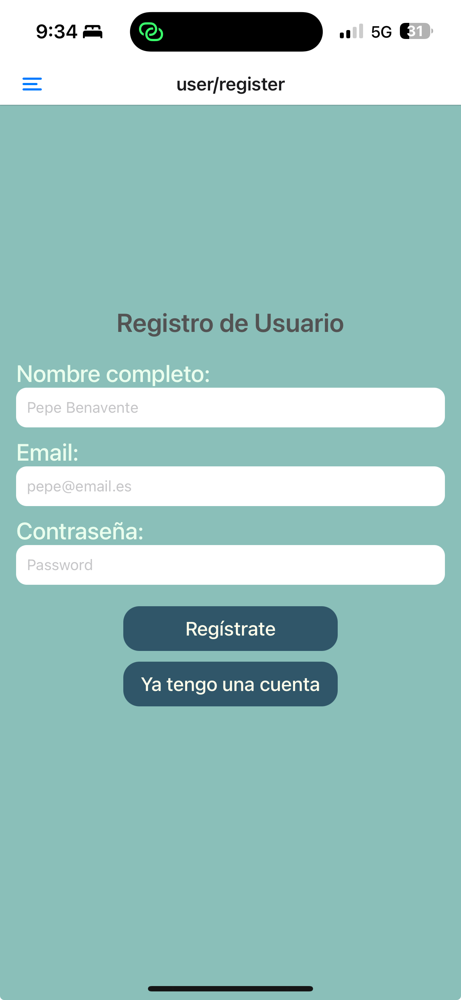
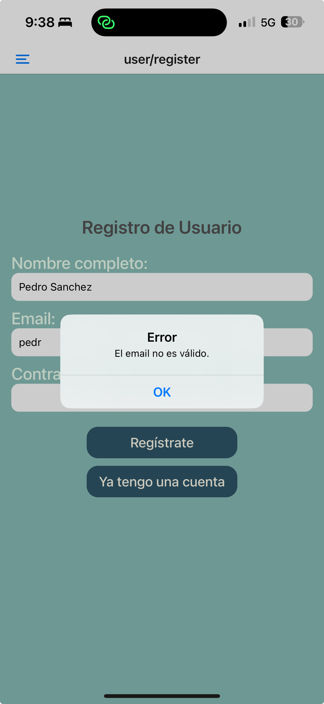
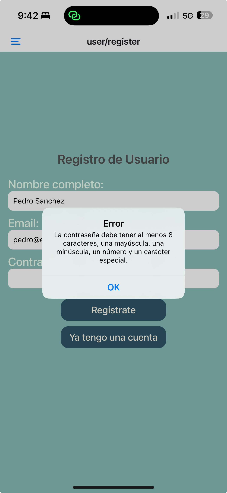
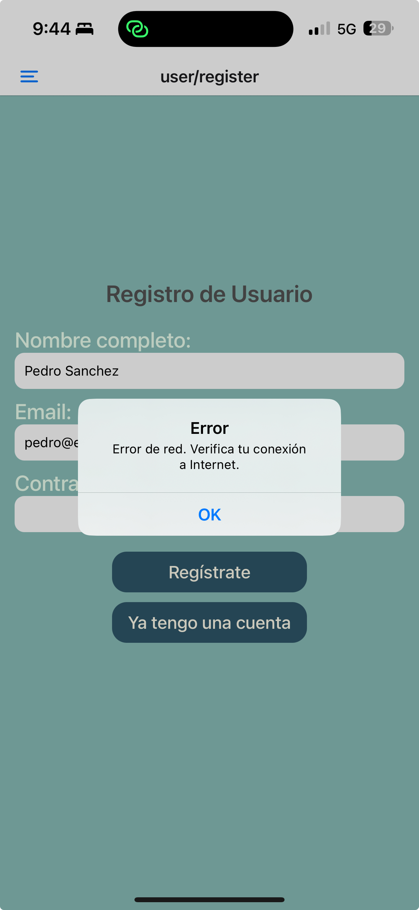

[<- Volver al README](../README.md)

# Registro de un nuevo usuario

## Requisitos cumplidos:

1. **Inputs de texto para el registro**:

   - Se han añadido tres campos de entrada (`TextInput`) para capturar el nombre completo, el email y la contraseña del usuario.
   - Cada campo tiene un `placeholder` descriptivo para guiar al usuario.

   

2. **Validación de inputs**:

   - Se ha implementado la validación del email y la contraseña utilizando funciones específicas (`validateEmail` y `validatePassword`) ubicadas en el archivo `utils/inputValidation.ts`.
   - La validación del email asegura que tenga un formato válido.
   - La validación de la contraseña verifica que cumpla con los requisitos de seguridad: al menos 8 caracteres, una mayúscula, una minúscula, un número y un carácter especial.

Estas funciones devuelven un objeto `ValidationResult`, con los atributos `isValid` y `message`, que indican si el input es válido y proporcionan un mensaje descriptivo en caso de error.

| **Captura**                                                                    | **Descripción**                                                                    |
| ------------------------------------------------------------------------------ | ---------------------------------------------------------------------------------- |
|          | Ejemplo de validación de un email con formato incorrecto.                          |
|  | Ejemplo de validación de una contraseña que no cumple los requisitos de seguridad. |
|                  | Mensaje de error mostrado al usuario en caso de problemas de red.                  |

3. **Llamada al servicio de la API**:

   - Se ha creado una función `registerUser` en el archivo `services/api.ts` que realiza una solicitud `POST` al endpoint de registro de usuario.
   - Los datos del formulario se envían en el cuerpo de la solicitud en formato JSON.

4. **Gestión de la respuesta de la API**:

- La respuesta de la API se procesa para mostrar mensajes de error o éxito al usuario mediante `Alert.alert`. Para ello, se reutiliza la interfaz `ValidationResult` para interpretar la respuesta del servidor.
  - En caso de éxito (isValid = true), se redirige al usuario a la pantalla de login utilizando `router.push("/user/login")`.
  - En caso de error (isValid = false), se muestra un mensaje descriptivo basado en el atributo `message` de la respuesta, ayudando al usuario a identificar el problema.

### Detalles adicionales:

- **Estilo y diseño**:

  - Se han aplicado estilos personalizados a los componentes utilizando `StyleSheet` para mantener una apariencia coherente con el tema de la aplicación.
  - Los colores y tipografías se importan desde los archivos `theme/color` y `theme/typography`.

- **Gestión de errores**:
  - Se controlan errores de red y respuestas inesperadas de la API, mostrando mensajes adecuados al usuario.

### Archivos relacionados:

- [`/app/user/register.tsx`](../../app/user/register.tsx): Implementación de la pantalla de registro.
- [`/services/api.ts`](../../services/api.ts): Función para realizar la solicitud de registro a la API.
- [`/utils/inputValidation.ts`](../../utils/inputValidation.ts): Funciones para validar el email y la contraseña.
- [`/types/user.ts`](../../types/user.ts): Definición del tipo `ValidationResult` utilizado en las validaciones y respuestas de la API.

[<- Volver al README](../README.md)
