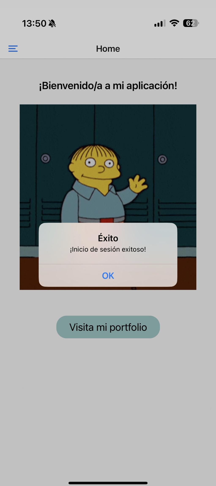

[<- Volver al README](../../README.md)

# Pantalla de Inicio de Sesión

### Requisitos Implementados

1. **Inputs de Texto para Email y Contraseña**  
   La pantalla de inicio de sesión incluye dos campos de entrada:

   - Un campo para el email, que valida el formato del correo electrónico. Ver implementación en [`inputValidation.ts`](../../utils/inputValidation.ts).
   - Un campo para la contraseña, que valida que cumpla con los requisitos mínimos de seguridad. Ver implementación en [`inputValidation.ts`](../../utils/inputValidation.ts).

2. **Botón para Validar y Llamar al Servicio de la API**  
   Se ha añadido un botón que, al presionarlo, ejecuta la función `submitForm`. Esta función:

   - Valida los inputs utilizando las funciones `validateEmail` y `validatePassword` en [`inputValidation.ts`](../../utils/inputValidation.ts).
   - Realiza una llamada al servicio de la API `loginUser` para autenticar al usuario. Ver implementación en [`api.ts`](../../services/api.ts).

3. **Control de Respuestas de la API**

   - En caso de error, se muestra un mensaje al usuario con la causa del fallo (por ejemplo, credenciales incorrectas o problemas de red). Ver lógica en [`login.tsx`](../../app/user/login.tsx).
   - En caso de éxito, se almacena el token devuelto por la API utilizando la librería `async-storage` y se redirige al usuario a la pantalla de bienvenida. Ver almacenamiento en [`storage.ts`](../../services/storage.ts).

4. **Almacenamiento del Token**  
   El token devuelto por la API se guarda en el almacenamiento interno del dispositivo mediante el servicio `saveToken` definido en el fichero [`storage.ts`](../../services/storage.ts).

5. **Enlace a la Pantalla de Registro**  
   Se ha añadido un enlace que permite a los usuarios no registrados navegar a la pantalla de registro. Ver implementación en [`login.tsx`](../../app/user/login.tsx).

### Capturas de Pantalla

#### Login Fallido

#### Login Exitoso

### Ficheros Relacionados

- **Pantalla de Login:** [`login.tsx`](../../app/user/login.tsx)
- **Validación de Inputs:** [`inputValidation.ts`](../../utils/inputValidation.ts)
- **Servicio de API:** [`api.ts`](../../services/api.ts)
- **Almacenamiento del Token:** [`storage.ts`](../../services/storage.ts)
- **Tipos de Usuario:** [`user.ts`](../../types/user.ts)
- **Estilos y Temas:** [`color.ts`](../../theme/color.ts), [`typography.ts`](../../theme/typography.ts)

[<- Volver al README](../../README.md)
