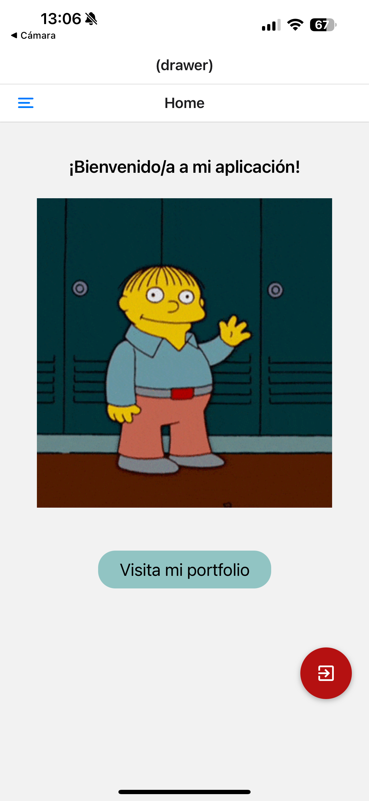
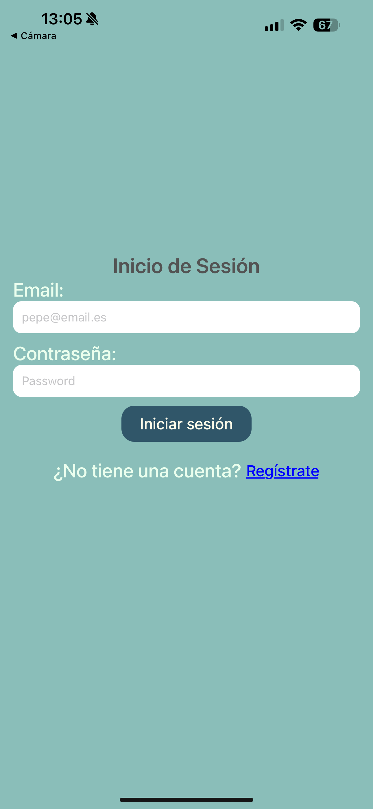

[<- Volver al README](../README.md)

# Implementación del Cierre de Sesión

### Requisitos Implementados

1. **Botón de Cierre de Sesión**  
   Se ha añadido un botón flotante en la esquina inferior derecha de la pantalla de bienvenida (`welcome.tsx`). Este botón utiliza el componente `Pressable` y un icono de la librería `MaterialCommunityIcons` para mejorar la experiencia visual del usuario.

2. **Eliminación del Token de Sesión**  
   Al presionar el botón de cierre de sesión, se ejecuta la función `handleLogout`. Esta función utiliza el servicio `removeToken` definido en [`storage.ts`](../../services/storage.ts) para eliminar el token de sesión almacenado en el dispositivo.

3. **Redirección a la Pantalla de Login**  
   Una vez eliminado el token, el usuario es redirigido automáticamente a la pantalla de inicio de sesión (`login.tsx`) utilizando el método `router.replace` proporcionado por `expo-router`.

4. **Control de Errores**  
   En caso de que ocurra un error al eliminar el token, se captura y se muestra en la consola para facilitar la depuración.

### Capturas de Pantalla

#### Botón de Cierre de Sesión

#### Redirección a la Pantalla de Login

### Ficheros Relacionados

- **Pantalla de Bienvenida:** [`welcome.tsx`](<../../app/(drawer)/welcome.tsx>)
- **Almacenamiento del Token:** [`storage.ts`](../../services/storage.ts)
- **Estilos y Temas:** [`color.ts`](../../theme/color.ts), [`styles.ts`](../../theme/styles.ts)

[<- Volver al README](../README.md)
