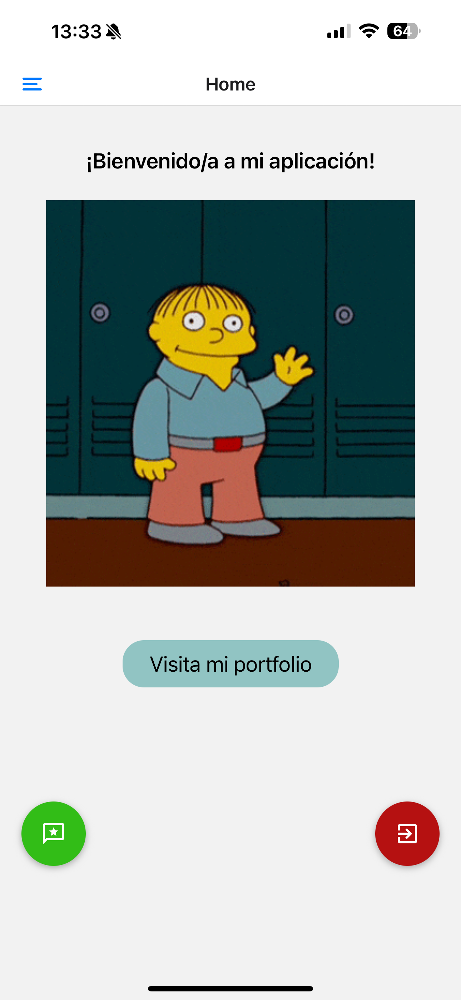
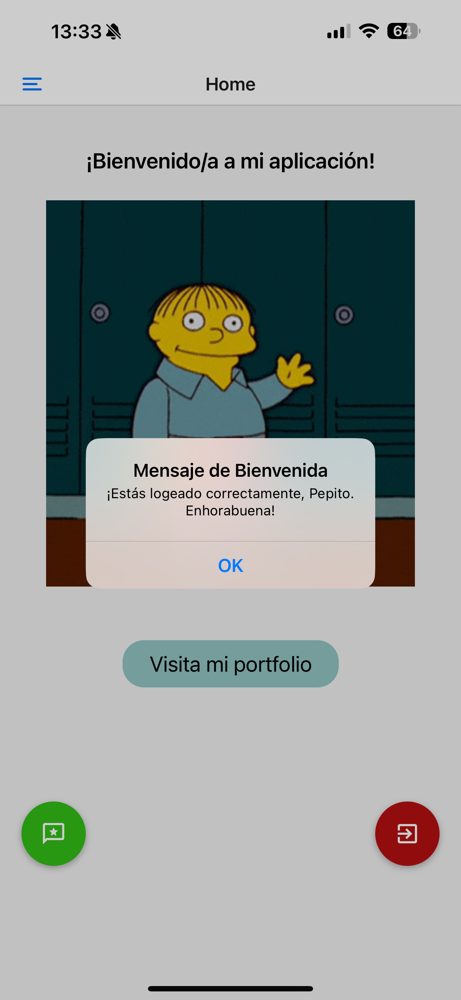

[<- Volver al README](../README.md)

# Botón en la pantalla de Bienvenida para mostrar un mensaje de alerta

En este documento se describe el proceso realizado para cumplir con el enunciado del ejercicio: "Añade un botón en la pantalla de Bienvenida que muestre una alerta con el mensaje devuelto por el endpoint de bienvenida con un token de usuario.".

### 1. Creación del botón en la pantalla de bienvenida

- Se añadió un nuevo botón en el archivo `welcome.tsx` utilizando el componente `Pressable` de React Native.
- Este botón se diseñó con un estilo específico (`styles.iconButton` y `styles.welcomeButton`) y un icono representativo (`MaterialCommunityIcons` con el nombre `message-star-outline`).
- El botón se posicionó en la parte inferior izquierda de la pantalla.

### 2. Implementación de la función `handleGetWelcomeMessage`

- Se creó la función `handleGetWelcomeMessage` en el archivo `welcome.tsx` para manejar la lógica del botón.
- Esta función realiza los siguientes pasos:
  1. Obtiene el token del usuario almacenado mediante la función `getToken` del servicio de almacenamiento.
  2. Verifica si el token es válido. Si no lo es, muestra una alerta de error.
  3. Llama al endpoint de bienvenida utilizando la función `getWelcomeMessage` del servicio `api.ts`, pasando el token como parámetro.
  4. Si la llamada es exitosa, muestra el mensaje de bienvenida en una alerta.
  5. Maneja posibles errores y muestra mensajes de error en caso de que algo falle.

### 3. Modificación del archivo `api.ts`

- Se implementó la función `getWelcomeMessage` en el archivo `api.ts` para realizar la solicitud al endpoint de bienvenida.
- La función realiza una solicitud HTTP GET al servidor, incluyendo el token del usuario en el encabezado de autorización.
- Maneja las respuestas del servidor y lanza errores específicos según el código de estado recibido.

### 4. Estilización del botón

- Se añadieron nuevos estilos en el archivo `welcome.tsx` para el botón y su icono:
  - `styles.welcomeButton`: Define el color de fondo y la posición del botón de bienvenida.
  - `styles.iconButton`: Define el tamaño, la forma y las sombras de botones que uso con iconos.
  - `styles.logoutIcon`: Define el color y el tamaño del icono de cerrar sesión.

## Capturas de pantalla

A continuación, se incluyen capturas de pantalla que muestran el botón añadido y las alertas generadas:

1. **Pantalla de bienvenida con el nuevo botón**  
   

2. **Alerta con el mensaje de bienvenida**  
   

[<- Volver al README](../README.md)
